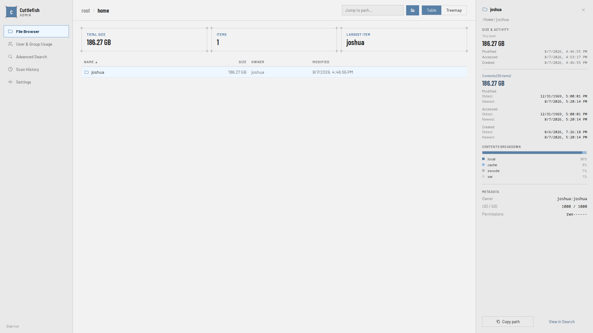

# Cuttlefish

A high-performance filesystem intelligence platform. Indexes billions of inodes into PostgreSQL, computes recursive directory statistics, and exposes everything through a REST API with a React browser UI.



---

## Components

| Component | Language | Role |
|---|---|---|
| `fs_indexer` | Rust | Walks the filesystem in parallel, writes raw metadata to PostgreSQL |
| `fs_aggregator` | Rust | Computes recursive directory and ownership statistics |
| `fs_api` | Go | REST API over the database; serves the compiled UI |
| `fs_ui` | TypeScript / React | Browser frontend |
| `fs_common` | Rust (lib) | Shared config, DB connection, and path hashing used by the Rust binaries |

---

## Installation (RPM)

Pre-built RPMs for Rocky Linux / RHEL / AlmaLinux are attached to each [GitHub Release](../../releases). A single package contains all binaries, the web UI, and all systemd units.

### 1. Install the package

**Rocky Linux / RHEL 9:**
```bash
sudo rpm -i cuttlefish-<version>-1.el9.x86_64.rpm
```

**Rocky Linux / RHEL 10:**
```bash
sudo rpm -i cuttlefish-<version>-1.el10.x86_64.rpm
```

### 2. Configure

```bash
sudo cp /etc/cuttlefish/fs_config.yml.example /etc/cuttlefish/fs_config.yml
sudo $EDITOR /etc/cuttlefish/fs_config.yml
```

At minimum set your PostgreSQL credentials and generate a session secret:

```bash
openssl rand -hex 32   # paste result into session_secret
```

### 3. Enable the API server

```bash
sudo systemctl enable --now cuttlefish-api
# → http://localhost:8080
```

### 4. Schedule nightly indexing

```bash
sudo systemctl enable --now cuttlefish-index.timer
```

This fires `fs_indexer` nightly at 2am. On success it automatically chains to `fs_aggregator`. Check the next scheduled run and last result:

```bash
systemctl status cuttlefish-index.timer
journalctl -u cuttlefish-index.service
journalctl -u cuttlefish-aggregate.service
```

To re-aggregate without re-indexing (e.g. after a config change):

```bash
sudo systemctl start cuttlefish-aggregate.service
```

---

## Systemd units

| Unit | Type | Description |
|---|---|---|
| `cuttlefish-api.service` | Service | REST API server — enable and run permanently |
| `cuttlefish-index.service` | Oneshot | Runs `fs_indexer` as root (scan root/threads from `fs_config.yml`); chains to aggregate on success |
| `cuttlefish-index.timer` | Timer | Triggers the indexer nightly at 2am (`Persistent=true`) |
| `cuttlefish-aggregate.service` | Oneshot | Runs `fs_aggregator` as the `cuttlefish` user |

---

## Configuration

All components read `fs_config.yml` from their working directory (`/etc/cuttlefish` when installed via RPM). The file is **gitignored** — use `fs_config_template.yml` as the starting point.

```yaml
database:
  host: localhost
  user: postgres
  password: "..."
  dbname: fs_index
  sslmode: require

indexer:
  root_path: /            # a single scan root for fs_indexer
  # root_paths:           # …or several, walked in parallel; must not overlap
  #   - /home
  #   - /srv/data
  threads: 8              # optional, defaults to 8; shared across all roots

auth:
  session_secret: "..."   # openssl rand -hex 32 — must be ≥ 32 chars

  local:                  # single admin account
    username: admin
    password: "..."

  # oidc:                 # uncomment to use SSO instead of local auth
  #   issuer: "https://accounts.google.com"
  #   client_id: "..."
  #   client_secret: "..."
  #   redirect_url: "http://yourhost/auth/callback"
```

The API server rejects a missing, default, or short `session_secret` at startup.

---

## Building from source

### Prerequisites

- Rust (stable)
- Go 1.26+
- Node.js 22+
- PostgreSQL client libraries

### Build

```bash
# 0640, not a plain cp: the config holds the DB password and session secret, and
# every component refuses to start if it is readable by other users on the host.
install -m 0640 fs_config_template.yml fs_config.yml
$EDITOR fs_config.yml
make all
```

### Run

```bash
cd /path/containing/fs_config.yml
sudo fs_indexer/target/release/fs_indexer         # index filesystem (root_path/threads from fs_config.yml; root required to scan)
fs_aggregator/target/release/fs_aggregator        # compute stats
fs_api/fs_api                                     # start API server → :8080
```

### Build targets

```bash
make all              # build everything
make build-indexer    # Rust release build of fs_indexer
make build-aggregator # Rust release build of fs_aggregator
make build-ui         # Vite production build of fs_ui → copies into fs_api/ui/
make build-api        # Go build of fs_api
make swagger-api      # regenerate Swagger docs then build API
make run-indexer      # build + scan /
make run-aggregator   # build + aggregate
make run-api          # build everything + start server
make clean            # remove all build artifacts and node_modules
```

---

## Database schema

Tables are created automatically on first run.

| Table | Written by | Description |
|---|---|---|
| `filesystem_index` | `fs_indexer` | One row per filesystem entry; primary key is SHA-256(path) |
| `identity_map` | `fs_indexer` | UID/GID → username/groupname |
| `scan_sessions` | `fs_indexer` | Per-run timestamps; used for stale-entry cleanup |
| `dir_stats` | `fs_aggregator` | Recursive size, file count, and time ranges per directory |
| `user_stats` | `fs_aggregator` | Total size and file count per UID/GID |

---

## API

Swagger UI is available at `http://localhost:8080/swagger/` once the server is running.

| Method | Path | Description |
|---|---|---|
| `GET` | `/api/list?path=` | List directory children |
| `GET` | `/api/file/stats?path=` | Single file metadata |
| `GET` | `/api/dir/stats?path=` | Single directory metadata + aggregates |
| `GET` | `/api/user/list` | User storage totals (sortable, paginated) |
| `GET` | `/api/group/list` | Group storage totals (sortable, paginated) |
| `POST` | `/auth/login` | Local login |
| `GET` | `/auth/oidc/start` | Begin SSO login flow |
| `POST` | `/auth/logout` | Clear session |
